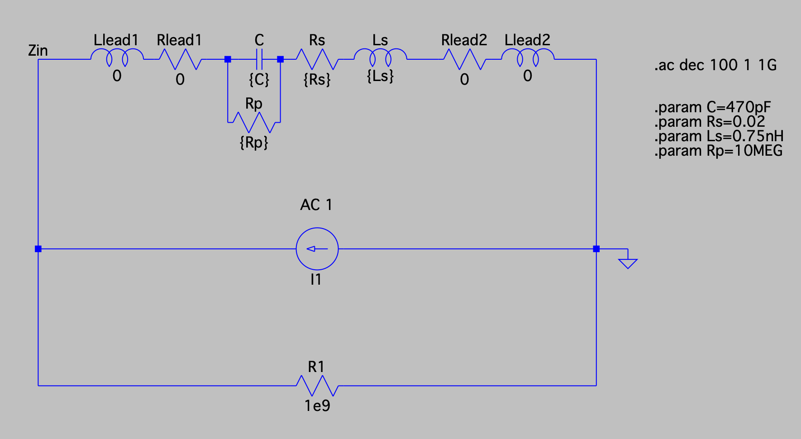
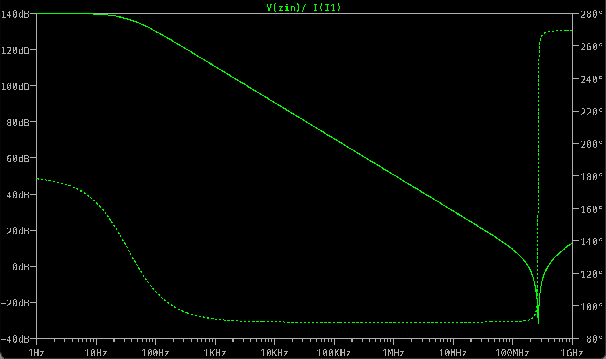
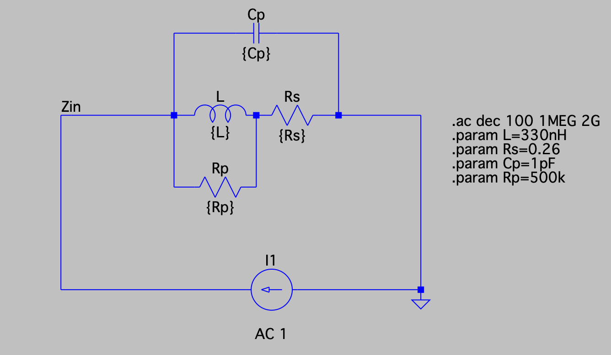
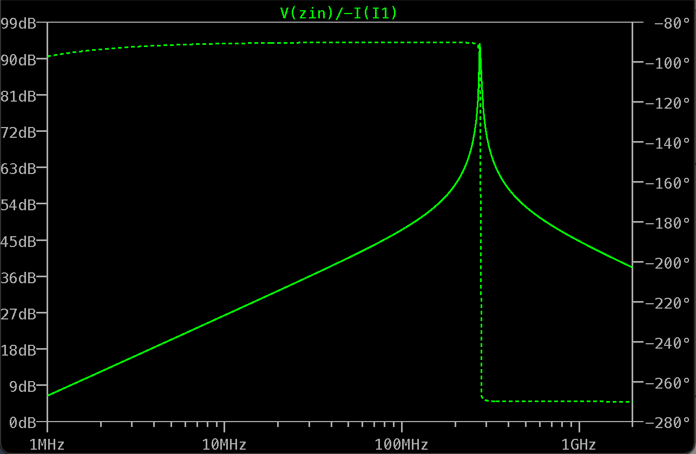
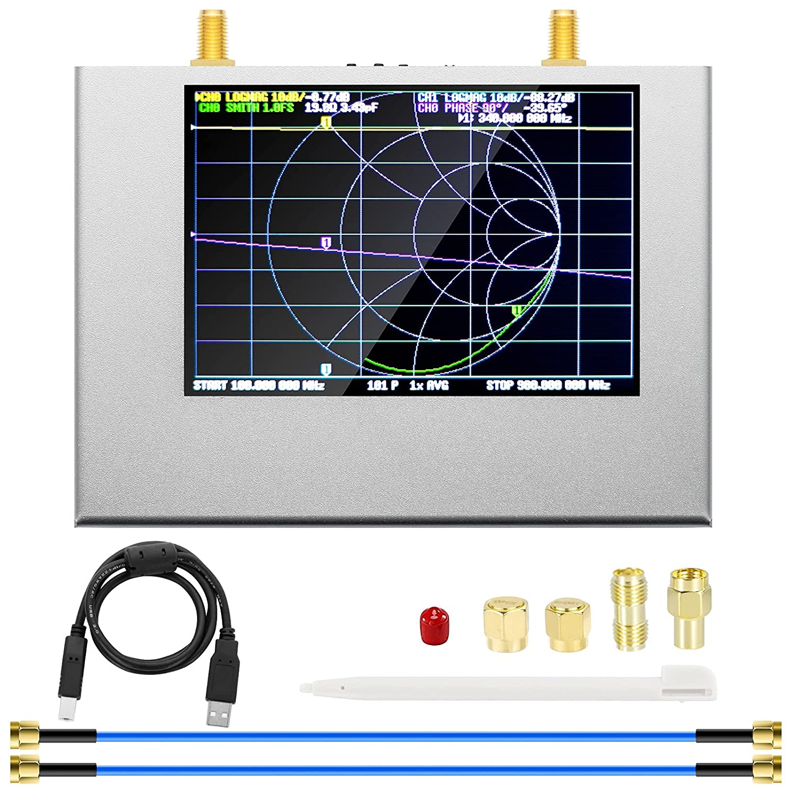
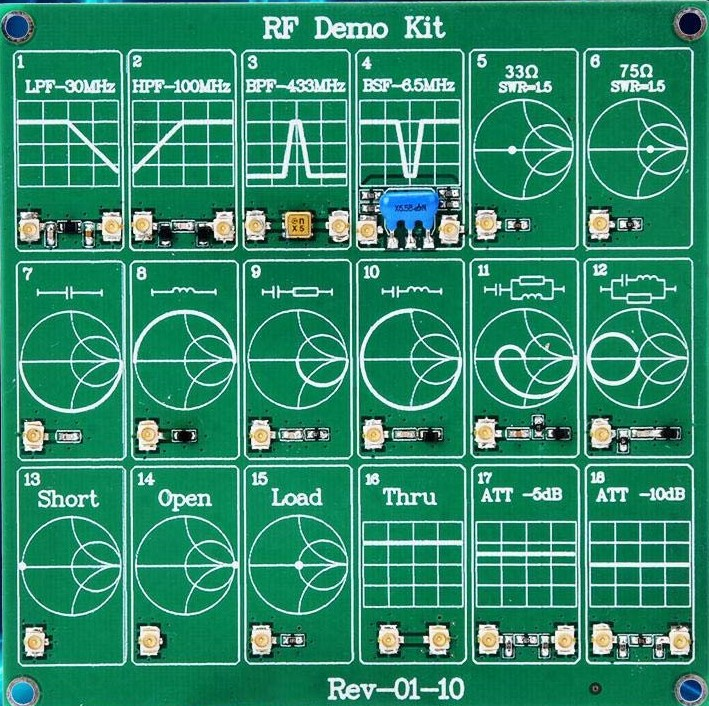
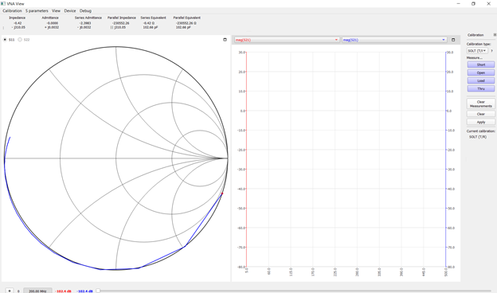
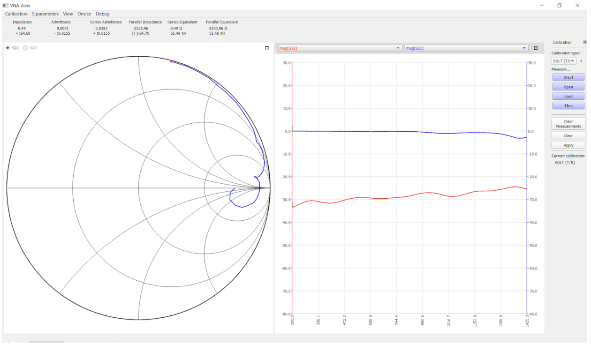
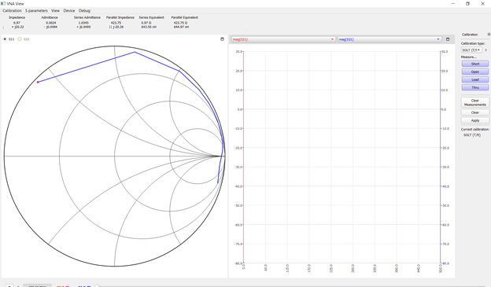
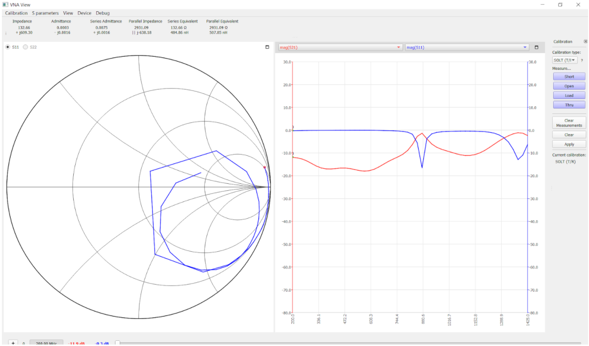

<h1 align = "center">LAB 1: Measuring the Parasitics of Passive Components with a VNA</h1>

<b>Author: Kylee Krzanich </b>

<b>Lab Partner: Angie Thai </b>

## Background
In this lab, we move beyond ideal representations of common passive components and analyze the effects of parasitics on functionality. More importantly, we learn how to calibrate and use a VNA which allows us to measure parasitics. 

### Capacitor
We begin by looking at the common capacitor. It's customary to represent the imedance of a capcitor as , however, this is an oversimplified model. In reality, every component always has parasitic properties that alter its impedance, capacitance, and inductance. As Steve likes to say, "we are getting three for the price of one!". You may be able to ignore parasitics if you are constructing simple, low frequency circuits, but as we begin to venture into the RF domain, these parasitics can have dire consequences on the functionality of your circuit. 

To make this analysis simpler, we will analyze the realistic model of the capacitor in LT spice shown in Fig.1. In these simulations I used a 470pF capacitor, the same value that I used in lab. I also simulated with 0Ohm leead resistance but in reality the leads of my capacitor were long enough that they would contribute to the ESR. 

Fig.1 - LT Spice Schematic of a Realistic Capacitor

Now, we use a spice directive to simulate the impedance of the capacitor, given by the equation , from 1Hz to 1GHz. I expect to see that at smaller frequencies there's no need to worry about parastics. As the frequency goes up, the parasitics will change the impedance drastically. 

Fig.2 - Impedance of a Realistic Capacitor from 1Hz to 1GHz

In Fig.2, we see that the impedance starts decreasing around 100Hz which represents the idealized model where impedance is roughly equal to . Then, there's a sharp dip around 250MHz. This dip is called the knee point and represents the self-resonance frequency. It can be used to find the ESL of our capacitor given by the equation 

### Inductor
Now, we can move on to the inductor and show a similar phenomenon. The formula for the imedance of an *ideal* inductor is given as . Like with a capacitor, an inductor also contains all three types of parasitics that significantly alter the functionality of your circuit. 

The realistic model of an inductor in LT spice is shown in Fig.3. The inductor I used in lab was a 2929SQ-331 inductor which has a value of 330 nH. Again, I simulated with 0Ohm lead resistance because my lead length was small and this value can usually be ignored at higher frequencies. 

Fig.3 - LT Spice Schematic of a Realistic Inductor

Now, we use a spice directive to simulate the impedance of the inductor, again given by the equation , from 1MHz to 2GHz. I expect to see the opposite 

Fig.4 - Impedance of a Realistic Inductor from 1MHz to 2GHz

In Fig.4, we see that the impedance rises linearly with increasing frequency which is characteristic for an inductor. Then, we see that the impedance peaks around 275MHz, aka the self-resonance frequency. The self resonance frequency can be used to find the equivalent parallel capacitance of our inductor using the equation . At frequencies higher that 275MHz, we see that our beautiful inductor starts acting like a capacitor, meaning that as frequency goes up, impedance goes down. 

## Measurements 

Now, that we've had some fun playing with LTSpice, lets learn how to use a VNA so that we can measure the parasitics of our real world components. 

### NanoVNA 

Fig.5 - Image of the NanoVNA V2 Plus4 

This was my first time using a VNA so I will give an overview of everything I learned. In lab, we were given the NanoVNA V2 Plus4, shown in Fig. 5, which has an operating frequency of 50kHz to 4.4GHz. The most important thing to rememeber when using a VNA is to *recalibrate often*! The **SOLT** calibration process stands for **S**hort, **O**pen, **L**oad, and **T**hrough. We had to recalibrate everytime we measured something new, switched out the cables, or changed the VNA settings. Fig.6 shows the RF Demo Kit and at the bottom you'll see the SOLT options that we used to calibrate our VNAs. 

Fig.6 - RF Demo Kit for Calibrating NanoVNA

### Capacitor 
Fig 7 depicts the VNA output of the RF Demo Kit Capacitor. We will use this as a baseline for future measurements. 

Fig.7 - VNA Output of RF Demo Kit Capacitor

Fig.8 shows the VNA output of a throughole 470pF capacitor. You can see on the Smith chart that the line crosses the horizontal axis twice indicating that there are two resonant frequencies. The chart also indicates that at certain frequencies, the capacitor will act as an inductor like we found in our LTSpice simulations. The resonance frequency in this case was around 1.3GHz. 

Fig.8 - VNA Output of 470pF Capacitor 

Comparing Fig.7 and Fig.8, we see a much clearer plot and resonance frequency on the Demo Kit plot. The surface mount component has much shorter leads than in our setup for the throughole component, resulting in a cleaner plot.

### Inductor 
Fig. 9 shows the VNA output of the RF Demo Kit inductor which we will again use as a baseline for comparison. 

Fig.10 - VNA Output of RF Demo Kit Inductor

The next item we measured with the VNA was a 330nH inductor. In Fig.10, we see that the inductor has multiple self-resonance frequencies and can act either as a capacitor or inductor. The sharpest point shows a self-resonance frequency of approximates 880Mhz. 

Fig.10 - VNA Output of 330nH Inductor

Again, we see a much clearer plot and resonance frequency on the Demo Kit plot when comparing Fig.9 and Fig.10. It's likely we severely damaged our inductor when we were soldering to our SMA test structure. 

## Conclusion
In this lab, we upgraded from ideal models to a more realistic model of a capacitor and inductor. In oue spice simulations, we saw how parasitics can change the behavior of these components. Then, we learned how to use a VNA to measure the parasitics so that we can characterize the beehavior of our components in our circuit and identify appropriate parts for our applications. We also saw the effects of lead capacitance and other non-idealities in our testing setup.

Key Takeaways:
- always calibrate!!!
- realistic models are a step up but don't fully capture our real world components

## Acknowledgements
A huge thank you to Steve and Joanna for creating such a comprehensive lab manual and guiding us throughout our experimentation. We would also like to give a shout out to Greig! His wealth of knowledge and experience was invaluable during this process. 
