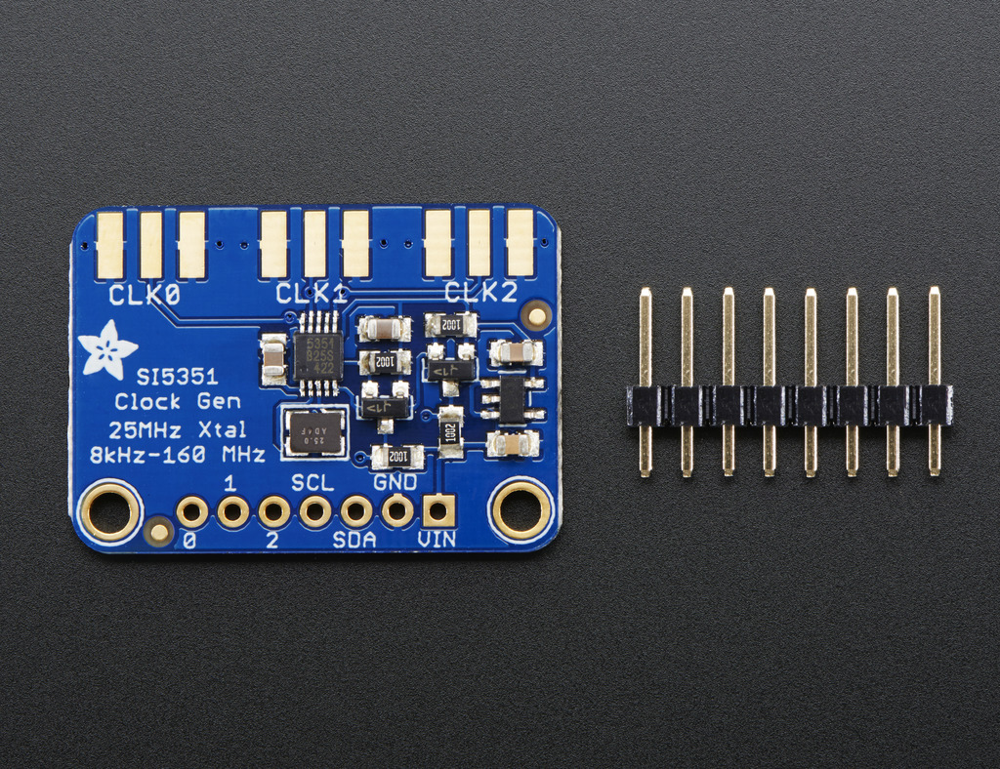
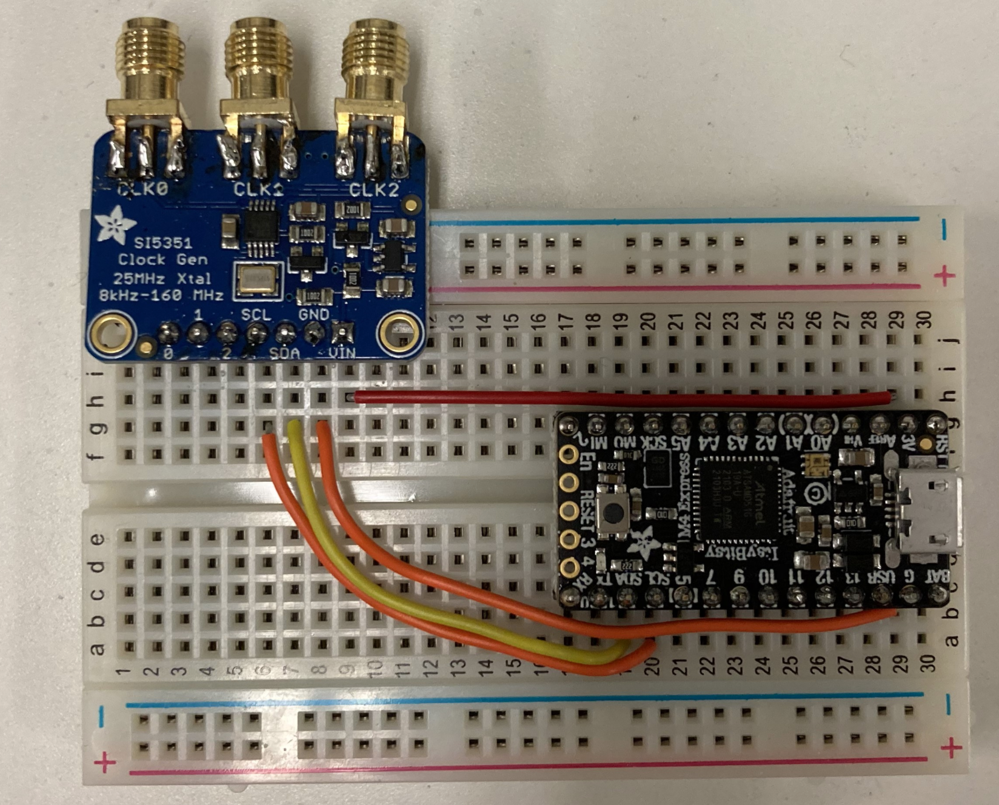
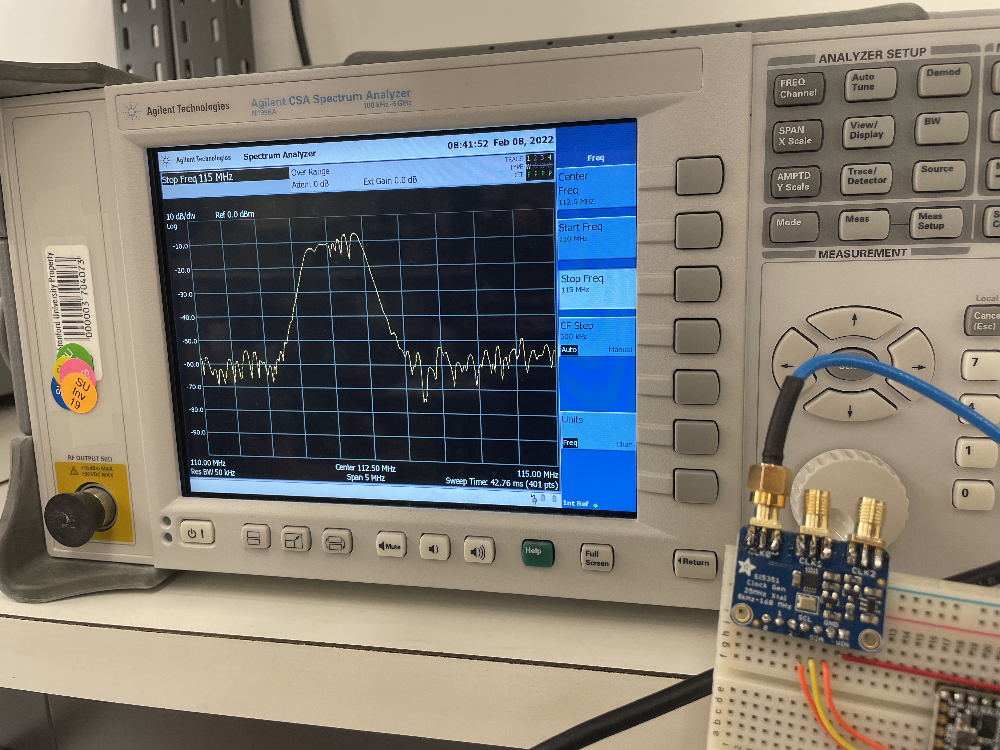
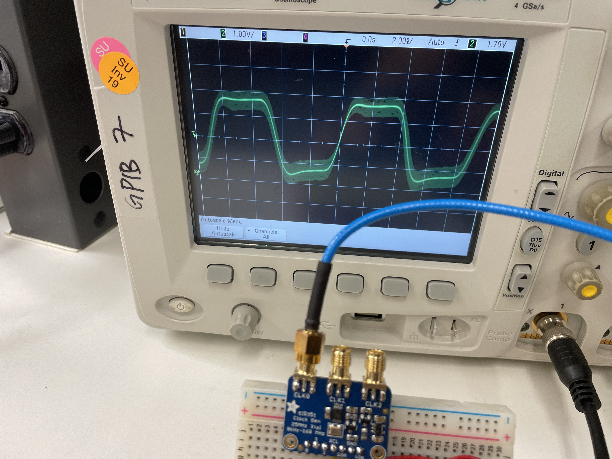
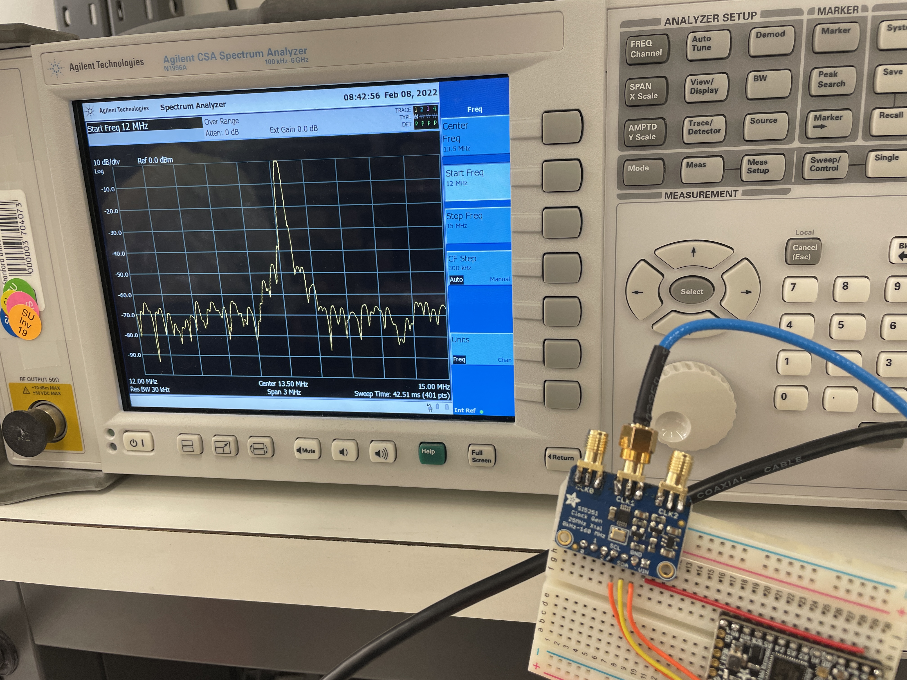
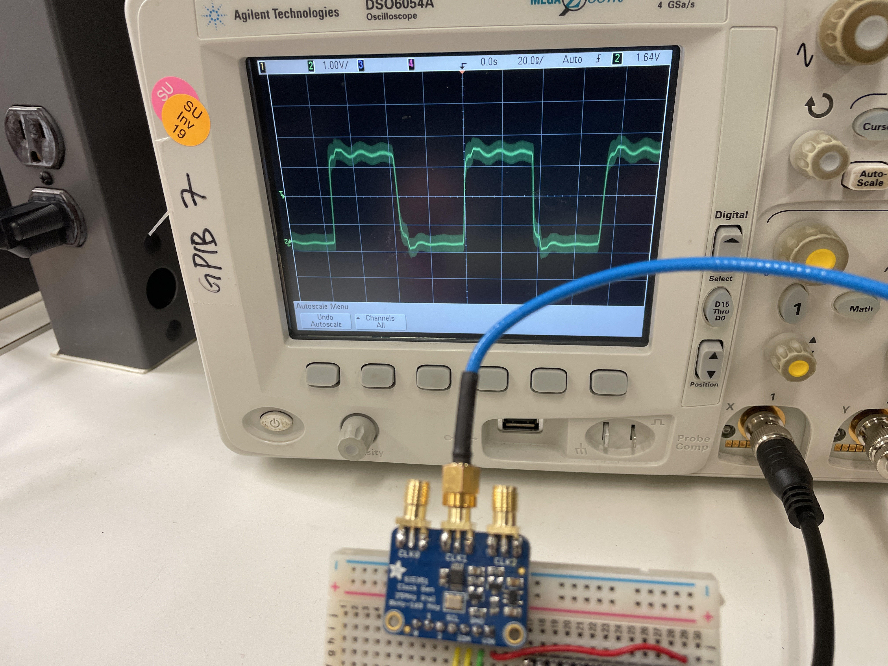
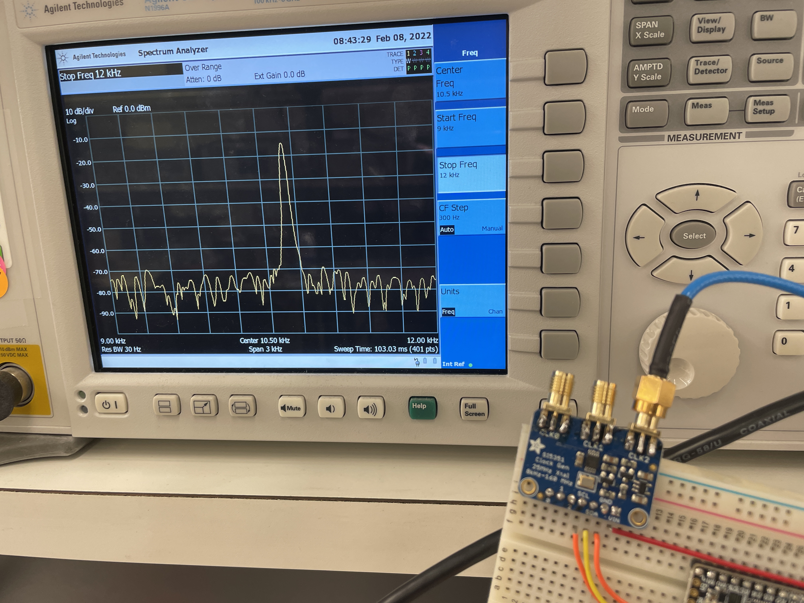
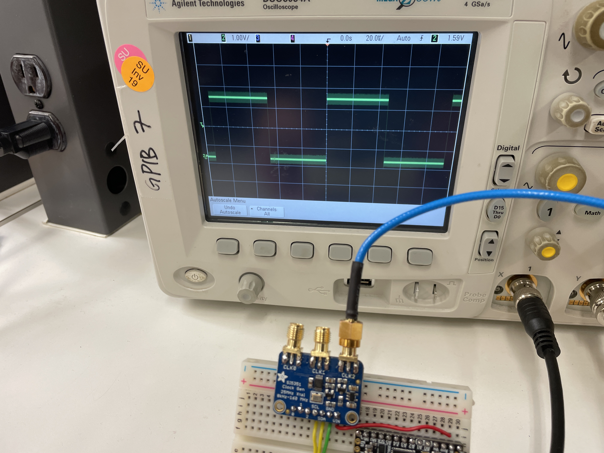

<h1 align = "center">Lab 2: Building a Clock Generator</h1>

<b>Author: Kylee Krzanich </b>

<b>Lab Partner: Angie Thai </b>

## Background
The purpose of this lab was to build our first clock generator. Clock generators are used in almost every application to synchronize circuits so it is essential to understand how they work. While previous course offerings focused on building Colpitts oscillators, we concentrated on the clock generator as it is far more common in modern circuits. In this lab, we demonstrated the functionality of the SI5351 clock generator IC controlled by an ItsyBitsy M4 Express. 

### Clock Generators

Fig.1 - Diagram of SI5351

The Si5351 clock generator is a low-cost and low-power IC that's used widely for applications ranging from performance test equipment to residential gateways. In Fig 1., the onboard precision clock and 25MHz reference crystal are indicated by the red circle. The IC also contains configurable PLL's and clock dividers which allow it to generate frequencies between 8kHz to 160MHz. The three SMA connectors correspond to three different outputs, each with a 3Vpp waveform. 

## Experiment

Fig.2 - Experimental setup for SI5351

Fig.2 Shows the experimental setup of our module. We put both the ItsyBitsy and SI5351 onto a breadboard and connected their I2C lines so that we could configure the frequency outputs. All of our code for this project was written in CircuitPython. First, we followed [these steps](https://github.com/adafruit/Adafruit_CircuitPython_SI5351) to load the Circuit Python bootloader onto our ItsyBitsy board. The code editor we used in this case was the [Mu Editor](https://codewith.mu/) because it allowed for seemlessly editing and uploading our code to the board. We then connected our SMA outputs to both the Spectrum Analyzer and the Oscilloscope to analyze the signal. 

## Results 

The initial code we ran configured the clocks to be 112.5 MHz, 13.6 MHz, and 10.76 kHz respectively. The process for configuring each clock starts with configuring the PLL. For example, PLL A is set to 900 Mhz using the following command: 
                   
    si5351.pll_a.configure_integer(36)
                   
In this case, we are simply by multiplying the 25 MHz onboard crystal by 36. Now, we set our clock divider to 8 to get the final frequency of 112.5 MHz for CLK0 with: 
                   
    si5351.clock_0.configure_integer(si5351.pll_a, 8)

The output of both the spectrum analyzer and the oscilloscope are show in Fig.3. 

Fig. 3 - Left: Frequency spectrum of CLK0 running at 112.5 MHz. Right: V vs t of CLK0 running at 112.5 MHz.

                   
Next, we showed the output of CLK1 which is running at a much lower frequency than CLK0. In Fig.4, the spectrum analyzer has a well-defined peak at 13.6 MHz and the oscilloscope output more closely resembles a square wave.  

Fig. 4 - Left: Frequency spectrum of CLK1 running at 13.6 MHz. Right: V vs t of CLK1 running at 13.6 MHz.

Finally, we examined the output of CLK2 which has a frequency that is several orders of magnitude lower than both the other clocks. In Fig.5, you can see that the spectrum analyzer shows significantly less noise and has a sharp peak around 10.76 kHz and the oscilloscope output looks like a perfect square wave.          

Fig. 5 - Left: Frequency spectrum of CLK2 running at 10.76 kHz. Right: V vs t of CLK2 running at 10.76 kHz.

As you can see, the signal integrety decreases significantly when we try to use the PLLs to multiply the clock frequency far beyond the 25 MHz crystal frequency. Looking back at Fig.3, we notice that at higher frequencies the output on the oscilloscope resembles more of a sine wave than a square wave. In this case, it's likely that coupling from the parasitics is acting like a low pass filter and generating the sinusoidal shape. As we get up to the edge of the frequency range, it is also possible that the slew rates of the various components on the board are too slow to reach the peak voltage at higher freqencies which explains the slope on the rise and fall. 

## Conclusion
In this lab, we studied the important of clock generators and their many applicatioins in modern circuit. Then we demonstrated how to setup and program the SI5351 using an ItsyBitsy and CircuitPython. Finally, we observed that the output degrades at higher frequencies which makes the SI5351 unsuitable for projects requiring precise timing at higher frequencies. 
