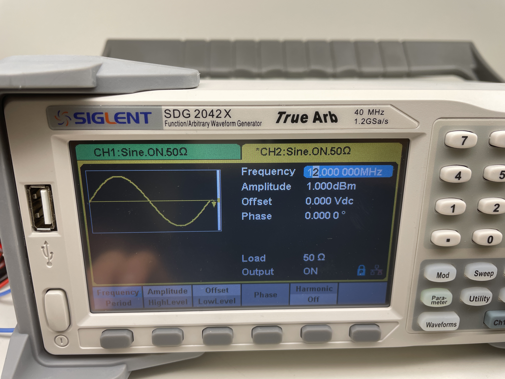
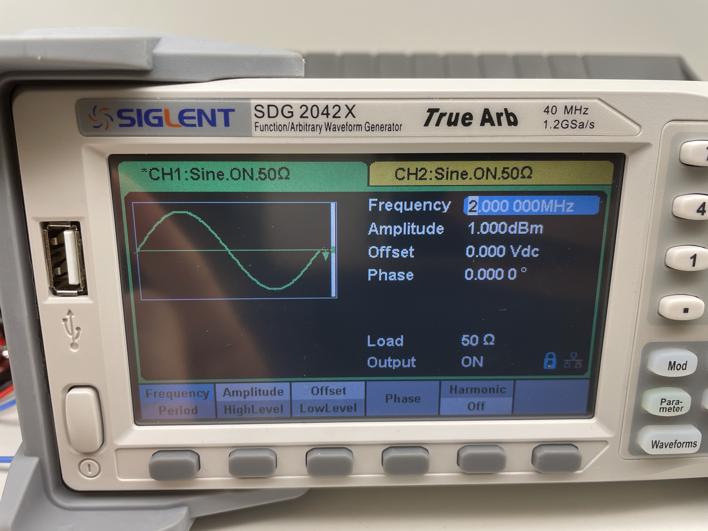
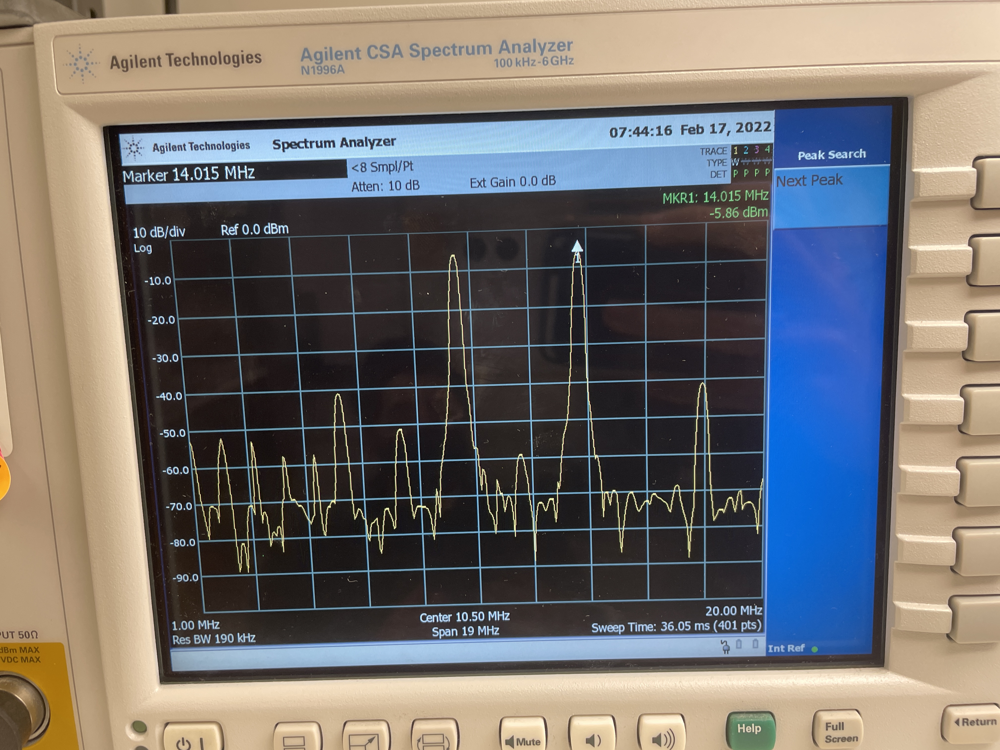
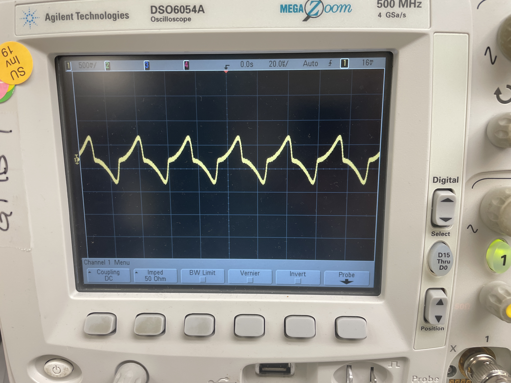

<h1 align = "center">LAB 3: Building a Mixer</h1>

<b>Author: Kylee Krzanich </b>

<b>Lab Partner: Angie Thai </b>

## Background
In this lab, we built our first passive double balanced RF mixer. Mixers are 3-port devices which take the sum and difference of two ports, RF and LO, and output both to the other port, IF. A double balanced mixer has full port isolation which allows it to increase linearity and supress more spurious products.

We chose to create FET ring mixers because they require less power for a given IIP3 (less leakage) and are popular for commercial use because of their extremely low cost. However, dioide ring mixers generally perform better because they are easier to match and therefore provide better rejection. 

### FET Ring Mixer
In Fig.1, you can see the schematic for a FET Ring Mixer. 

Fig.1 - Schematic of a FET Ring Mixer

Based off of the diagram above, we used the following parts to assemble the circuit: 

- [PE4141](https://www.psemi.com/pdf/datasheets/pe4141ds.pdf)
- [ADT4-1WT+](minicircuits.com/pdfs/ADT4-1WT+.pdf)
- [50 Ohm Coaxial SMA Connector](https://www.mouser.com/datasheet/2/18/1/amphs06495_1-2259698.pdf)

As shown in Fig.2, we preplanned the connections using the selectted parts to make construction easer. 

Fig.2 - Diagram of circuit using selected parts

## Results

First, we will analyze at the output of the mixer by using a function generator to set LO to 12 MHz and RF to 2 MHz as shown in Fig.3. This is called down-conversion 

Fig. 3 - Left: LO at 12MHz. Right: RF at 2MHz.

Now, looking at Fig.4, we can see that the output shown on the Spectrum Analyzer is exactly as expected. We have a peak at 10 MHz which represents  and then another large peak at 14 MHz which represents . 

Fig.4 - IF shown on Spectrum Analyzer

To find the 1db compression point, we changed the input level of RF by 1db at a time and found the point where the gain of IF no longer increased by 1db. In our case, the compression point was 15db and the corresponding IF output is shown in Fig. 4. As depicted in Fig.5, the idea is that we should always operate the mixer below the compression point because above it our mixer acts as a non-linear device so we will see a lot of distortion, harmonics and spurious products. 

Fig.5 - Plot of compression point 

The conversion loss is given by   dB. This number is important because it will determine the amount of amplication we'd need in later stages. 

Fig.6 - Minimum IF Frequency

To find the minimum IF frequency, we started with RF at 12.1 MHz and LO at 12 MHz. Then, we decreased RF until IF deteriorated significantly. In Fig.6, you can see IF no longer resembles a sinusoid which means we've hit the minimum IF frequency. The dioide mixers should be able to hit DC frequency but we used FET mixers so our  minimum IF frequency corresponds to  kHz. 

The reason the FET ring mixers can't reach 

## Conclusion

## Acknowledgements
Thank you to Greig for helping design the FET circuit as well as provide a 5 Mhz low pass filter for viewing the minimum IF frequency on the oscilloscope. 
