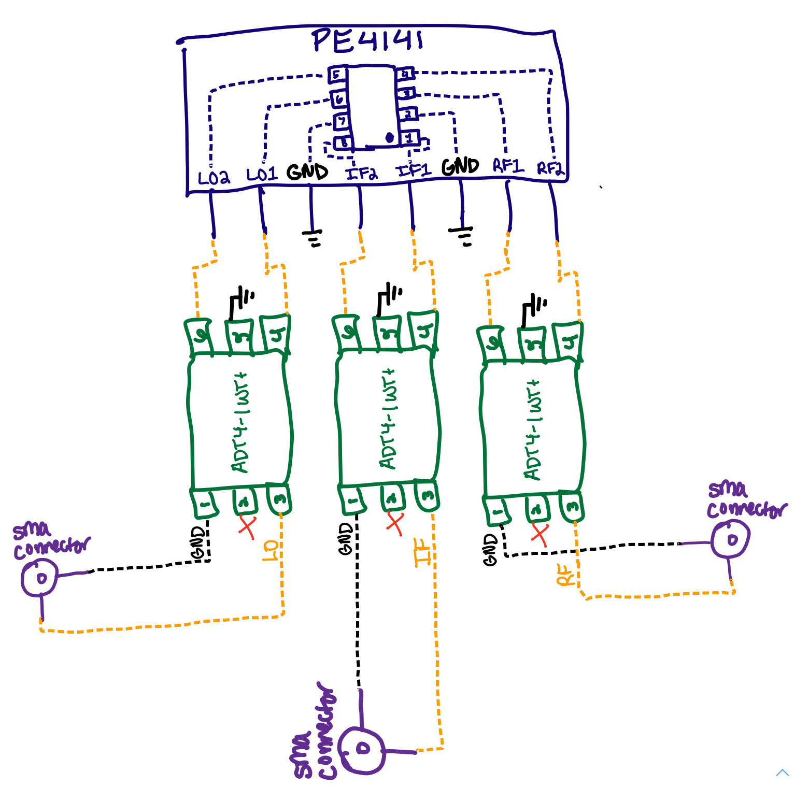

<h1 align = "center">LAB 3: Building a Mixer</h1>

<b>Author: Kylee Krzanich </b>

<b>Lab Partner: Angie Thai </b>

## Background
In this lab, we built our first RF mixer. Mixers are 3-port devices which take the sum and difference of two ports, RF and LO, and output both to the other port, IF. We chose to create FET ring mixers because they are have some gain and are popular for commercial use. However, dioide ring mixers generally perform better because they are easier to match and therefore provide better rejection. 

### FET Ring Mixer
In Fig.1, you can see the schematic for a FET Ring Mixer. 

Fig.1 - Schematic of a FET Ring Mixer

Based off of the diagram above, we used the following parts to assemble the circuit: 

- [PE4141](https://www.psemi.com/pdf/datasheets/pe4141ds.pdf)
- [ADT4-1WT+](minicircuits.com/pdfs/ADT4-1WT+.pdf)
- [50 Ohm Coaxial SMA Connector](https://www.mouser.com/datasheet/2/18/1/amphs06495_1-2259698.pdf)

As shown in Fig.2, we preplanned the connections using the selectted parts to make construction easer. 

Fig.2 - Diagram of circuit using selected parts

## Results

Now, that we've had some fun playing with LTSpice, lets learn how to use a VNA so that we can measure the parasitics of our real world components. 

## Conclusion

## Acknowledgements

