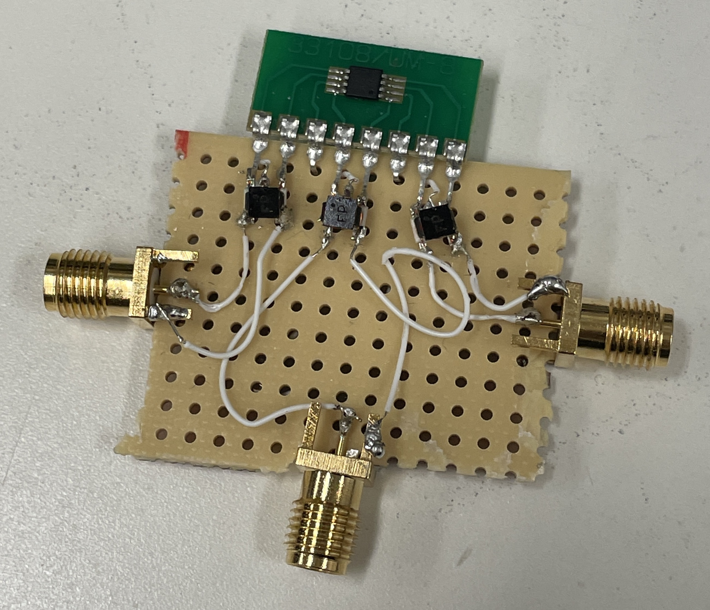
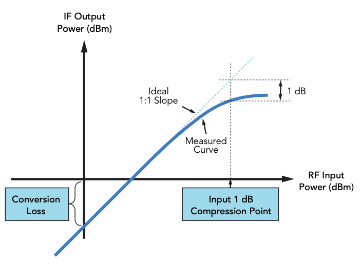

<h1 align = "center">LAB 3: Building a Mixer</h1>

<b>Author: Kylee Krzanich </b>

<b>Lab Partner: Angie Thai </b>

## Abstract
Mixers are extremely pervasive in modern circuits, with applications ranging from radio receivers to phase detectors. The purpose of a mixer is to shift signals from one frequency span to another so that the signal can be transmitted or undergo additional processing. In this lab, we present a hand-built double balanced passive RF Mixer. The architecture we chose was a FET ring mixer based on its popularity in modern wireless communication. We then evaluate our mixer based on common performance metrics including the noise figure, linearity, conversion loss, and port isolation. 

## Background
 First, we will give some information on passive double balanced switching RF mixer. Mixers are 3-port devices that take the sum and difference of two ports, RF and LO, and output both to the other port, IF. The mixer is passive in that it is not connected to a power source or configured in such a way as to provide gain. A double balanced mixer has full port isolation which allows it to increase linearity and suppress more spurious products. We also used a switching mixer topology instead of a multiplier because we wanted to limit the noise penalty of our circuit. 

We chose to create a FET ring mixer because they require less power for a given IIP3 (less leakage) and are popular for commercial use because of their extremely low cost. However, diode ring mixers generally perform better because they are easier to match and therefore provide better rejection. 

### FET Ring Mixer
In Fig.1, you can see the schematic for a FET Ring Mixer. 

Fig.1 - Schematic of a FET Ring Mixer

Based off of the diagram above, we used the following parts to assemble the circuit: 

- [PE4141](https://www.psemi.com/pdf/datasheets/pe4141ds.pdf)
- [(3) ADT4-1WT+](minicircuits.com/pdfs/ADT4-1WT+.pdf)
- [(3) 50 Ohm Coaxial SMA Connector](https://www.mouser.com/datasheet/2/18/1/amphs06495_1-2259698.pdf)
- [copper-clad strip board](https://www.technobotsonline.com/95mm-x-127mm-copper-clad-stripboard.html)

The PE4141 module represents the FET ring. Looking at the datasheet, each of its inputs is rated for frequencies ranging from 10 kHz to 1 GHz. The PE4141 is made from GaAs so that it can be used in nuclear magnetic resonance/magnetic resonance imaging (MRI) applications. 

As shown in Fig.2, we preplanned the connections using the selected parts to make construction easier. 

Fig.2 - Diagram of circuit using selected parts

In Fig.3, we show the final result. The entire circuit was built on top of a 2" x 2" piece of copper clad strip board. Each part of the board was verified for connectivity using a multimeter.   

Fig.3 - Image of final circuit

## Results

First, we will analyze at the output of the mixer by using a function generator to set RF to 12 MHz and LO to 2 MHz as shown in Fig.4. This configuration is known as a high-side downconverter since RF is set to a higher frequency than our LO input. 

Fig. 4 - Left: LO at 12MHz. Right: RF at 2MHz.

Now, looking at Fig.5, we can see that the output shown on the Spectrum Analyzer is exactly as expected. We have a peak at 10 MHz which represents  and then another large peak at 14 MHz which represents . 

Fig.5 - IF shown on Spectrum Analyzer

You can see there is quite a bit of suprious products in the output IF. This is caused when noise at various frequencies enters the circuit and is unintentionally mixed. An image product is a signal that lies equidistant from LO on the opposite side of RF. Despite the fact that the PE4141 claims it has integrated image rejection, we still see a clear peak at 18 MHz which corresponds to the image product frequency. To remove this, we could add a filter at the input or find a FET ring mixer with better rejection properties. 

Fig.6 - Plot of compression point 

To find the 1db compression point, we changed the input level of RF by 1db at a time and found the point where the gain of IF no longer increased by 1db. In our case, the compression point was 15db and the corresponding IF output is shown in Fig. 6. As depicted in Fig.7, the idea is that we should always operate the mixer below the compression point. Above it, the output power is saturated and our mixer acts as a non-linear device so we will see a lot of distortion, harmonics and spurious products. Below the compression point, we should see that the gain is constant with respect to the RF power. 

Fig.7 - Plot of compression point 

The datasheet claims that the PE4141 has a 7.0-8.0 dB conversion loss. This number is important because it will determine the amount of amplification we'd need in later stages. Based on our experimental findings, the conversion loss is given by Output IF power [dBm] – RF input power[dBm] =  dB. The discrepancy is likely due to the shoddiness of our construction. The conversion loss for FET rings are also known to be much higher than diode rings so precausions should be taken to minimize this figure. 

Fig.8 - Minimum IF Frequency

To find the minimum IF frequency, we started with RF at 12.1 MHz and LO at 12 MHz. Then, we decreased RF until IF deteriorated significantly. In Fig.8, you can see IF no longer resembles a sinusoid which means we've hit the minimum IF frequency. The diode mixers should be able to hit DC frequency but we used FET mixers so our  minimum IF frequency corresponds to  kHz. This is about 3 times higher than its stated IF frequency range. 

## Conclusion
To summarize our results, we will look at how our FET ring performed according to the following key metrics: 

__Compression Point__
The compression Point is an essential metric in a circuit because it gives the upper bound for when your signal will begin to see some distortion. The compression point is a function of the switch transition time and so it is largely determined by the underlying architecture. For example, FET Mixers have higher P1dB than Diode mixers but, by selecting diodes with fast turn-on frequency capabilities, you can significantly improve the P1dB. In this case, we measured a compression point of 15dB which was around 4-6dB higher than a comparable diode ring mixer. 

__Conversion Loss__
Since we are using a passive architecture, it is normal to assume there will be some conversion loss. FET ring mixers have especially high conversion loss in comparison with diode ring mixers. We found our mixer had a conversion loss of 9db which was in the upper range of the product specification. In an application circuit, we would attach our mixer to an amplifier so this number would come in handy when defining the later stages of the system. 

__Minimum IF Frequency__
Our mixers were only able to obtain a 30 kHz minimum IF frequency before showing significant signal deterioration. The PE4141 is only rated to go to 10 kHz which still does not allow for Zero-IF. The advantage of Zero-IF is that it avoids the spurious image product issue and allows us to remove a lot of the filtering circuitry. On the other hand, decreasing the IF frequency requires us to increase the LO isolation as any leakage will severely corrupt the IF output. Our FET ring mixers cannot reach zero-IF, however, the diode ring mixers should go to DC. 

In conclusion, we went over the role of mixers, surveyed their architecture and functionality, built our very own double-balanced FET ring mixer, and, lastly, evaluated the performance of our mixer. 

## Acknowledgments
Thank you to Greig for helping design the FET circuit as well as providing a 5 Mhz low pass filter for viewing the minimum IF frequency on the oscilloscope. 
